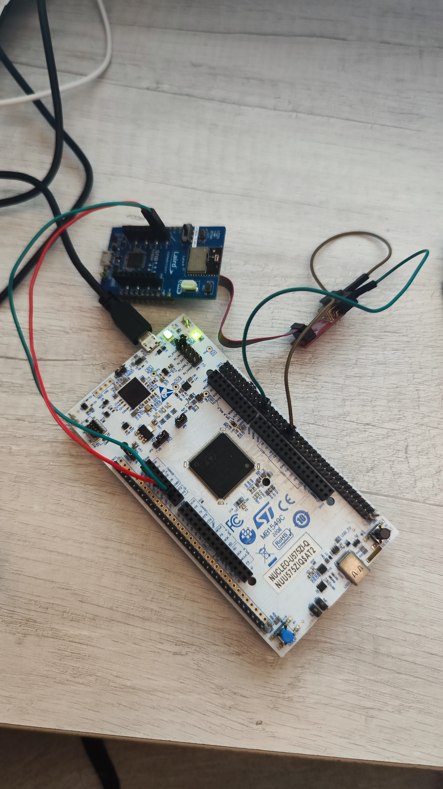

# BLE Lyra

This repository offers support to implement useful AT commands in C for the Lyra Series Bluetooth 5.3 Modules designed by Ezurio via UART.

[Ezurio Lyra Series Bluetooth 5.3 Modules](https://www.ezurio.com/wireless-modules/bluetooth-modules/bluetooth-5-modules/lyra-series-bluetooth-53-modules)

This has been created with the idea of connecting one client and one server. Multiple connections are not handled.

## Installation

## Using

This library aims to implement most of the useful AT commands for establishing a connection between a unique client and server. It is important to note that multiple connections are not handled.

Misuse of commands is partially avoided via code, but not entirely. Therefore, it is possible to use a bad configuration that the C code accepts.

## Installation

Once you have created the project, just include the folder `blelaird` in your project. You can simply copy the folder into the project.

Library `stm32u5xx_hal.h` must be included, and in `main.h` you have to add: `extern UART_HandleTypeDef huart1;`.
